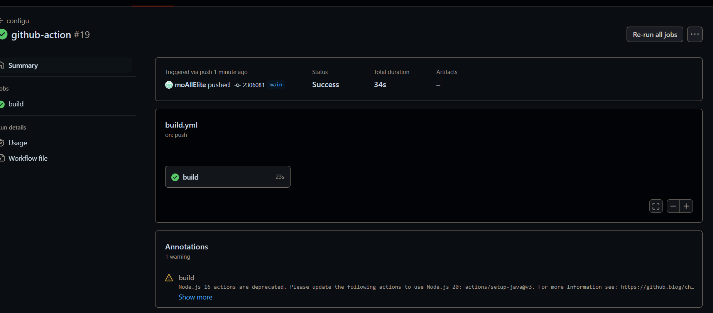
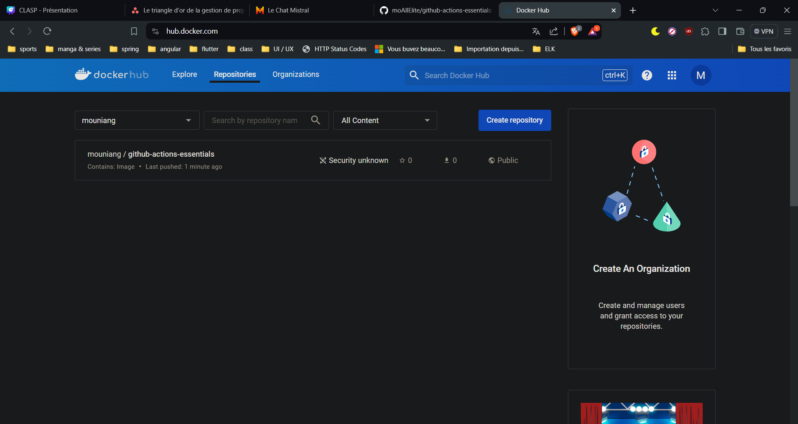
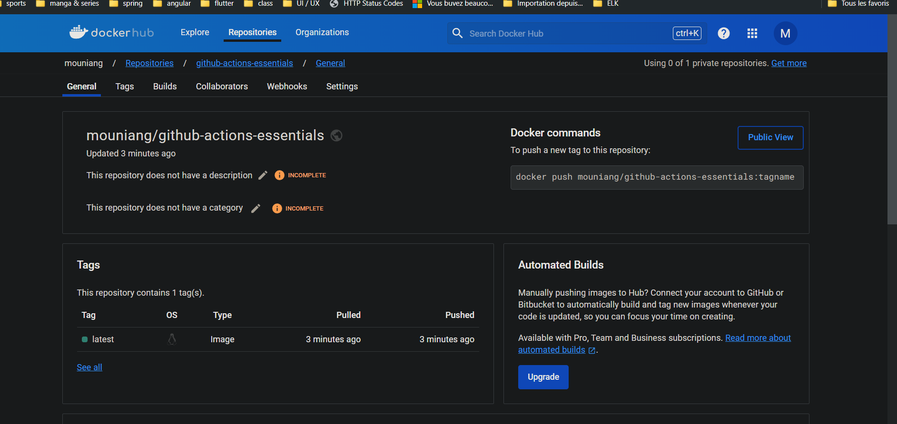

# GITHUB ACTIONS

## 1.Jobs status

## 2.Deployed successfully to DOCKER




You can pull the project with the following link
````
docker pull mouniang/github-actions-essentials
````
# MADE BY MOUHAMED NIANG pop smoke GOAT DRILL